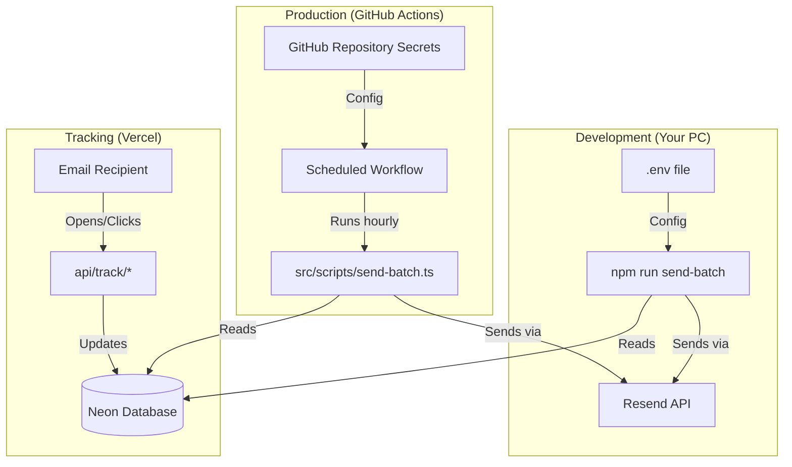

# System Architecture

## Key Concept: Two Separate Worlds
1.  **Your Computer (Local)**: Uses `.env` file. You run scripts manually here.
2.  **GitHub Actions (Cloud)**: Does **NOT** have your `.env` file. It uses **GitHub Secrets**.
    *   This is where the *automatic* hourly emails happen.

## Vercel's Role
Vercel **only** hosts the "Tracking Pixels" and "Link Redirects". It does **not** send the emails.
*   When a user opens an email, they are technically visiting your Vercel site (`clura.dev/api/track/open`).
